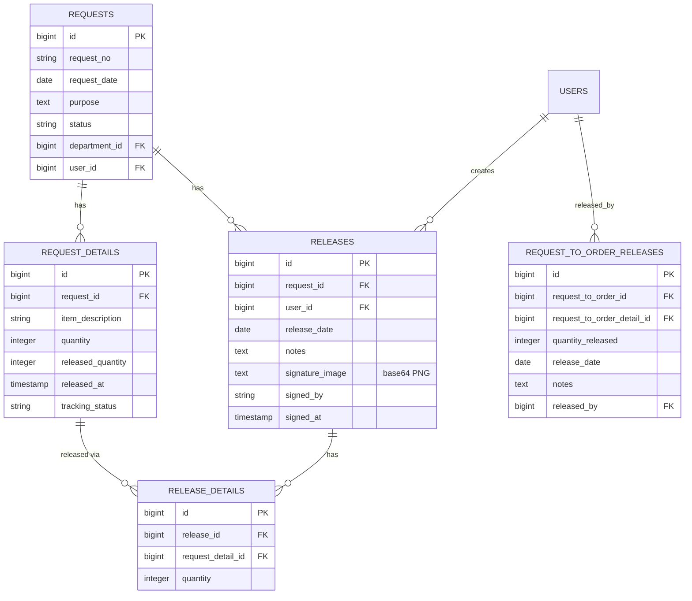
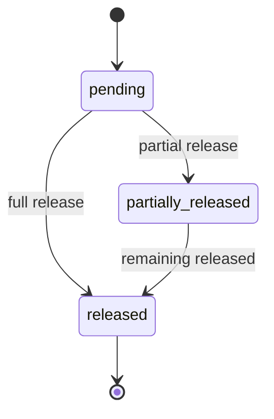

# Data Model — Releasing

> The database schema backing the releasing process, including both release flows and the receiver signature storage.

---

## Entity Relationship Diagram



---

## Table: `releases`

> The parent release record — **this is where the receiver signature lives.**

**Migration:** `2025_05_17_011833_create_releases_table.php` + `2025_05_18_000000_add_signature_fields_to_releases_table.php`

| Column | Type | Nullable | Notes |
|--------|------|----------|-------|
| `id` | bigint PK | No | Auto increment |
| `request_id` | foreignId → `requests.id` | No | `cascadeOnDelete` |
| `user_id` | foreignId → `users.id` | No | Who performed the release |
| `release_date` | date | Yes | |
| `notes` | text | Yes | |
| `signature_image` | text | Yes | **Raw base64 PNG** (no `data:` prefix) |
| `signed_by` | string | Yes | Receiver's name |
| `signed_at` | timestamp | Yes | |
| `created_at` / `updated_at` | timestamp | Yes | |

**Model:** `app/Models/Release.php`
```php
protected $fillable = ['request_id', 'user_id', 'release_date', 'notes',
                       'signature_image', 'signed_by', 'signed_at'];
// Relations: request() BelongsTo, user() BelongsTo, details() HasMany
```

---

## Table: `release_details`

> Line items of a release — what was actually handed out.

**Migration:** `2025_05_17_012017_create_release_details_table.php`

| Column | Type | Nullable | Notes |
|--------|------|----------|-------|
| `id` | bigint PK | No | |
| `release_id` | foreignId → `releases.id` | No | `cascadeOnDelete` |
| `request_detail_id` | foreignId → `request_details.id` | No | `cascadeOnDelete` |
| `quantity` | integer | No | Quantity released on this line |

**Model:** `app/Models/ReleaseDetail.php`
```php
protected $fillable = ['release_id', 'request_detail_id', 'quantity'];
// Accessors: getRemainingQuantityAttribute, getFullyReleasedAttribute
```

> [!note] Accessor caveat
> `getRemainingQuantityAttribute()` reads `$this->released_quantity` — which is **not a column on `release_details`**; it belongs to `request_details`. This accessor only behaves correctly when the model is joined with the request detail's released quantity (e.g., via eager-loading or a `withSum` query).

---

## Table: `request_details` (affected columns)

> Tracks per-line release progress on the originating request.

| Column | Purpose |
|--------|---------|
| `quantity` | Requested quantity |
| `released_quantity` | **Incremented** on each release |
| `released_at` | Timestamp of last release |
| `tracking_status` | `pending` (default) → `completed` \| `partial` |

---

## Table: `request_to_order_releases` (no signature)

> The Request-To-Order release flow — **no receiver signature is captured** here.

**Migration:** `2025_07_20_141137_create_request_to_order_releases_table.php`

| Column | Type | Notes |
|--------|------|-------|
| `id` | bigint PK | |
| `request_to_order_id` | foreignId | `cascadeOnDelete` |
| `request_to_order_detail_id` | foreignId | `cascadeOnDelete` |
| `quantity_released` | integer | |
| `release_date` | date | |
| `notes` | text nullable | |
| `released_by` | foreignId → `users.id` | Who performed the release (no signature) |

**Model:** `app/Models/RequestToOrderRelease.php`
- Relations: `order()`, `detail()`, `releasedBy()`
- Related accessors on `RequestToOrderDetail`: `getTotalReleasedAttribute`, `getRemainingQuantityAttribute`

---

## Status Lifecycle



- **Request detail level:** `tracking_status` = `completed` | `partial`
- **Request level:** `status` = `released` | `partially_released` (set by `updateRequestStatus()` in `Api/RequestController.php:686`)

---

> [!info] Related
> - [[Overview|Releasing Process Overview]]
> - [[End-to-End-Flow|End-to-End Flow]]
> - [[Receiver-Signature|Receiver Signature Capture]]
> - [[Inventory-Integration|Inventory Integration & Auto-Deduction]]
> - [[API-Reference|API Reference]]