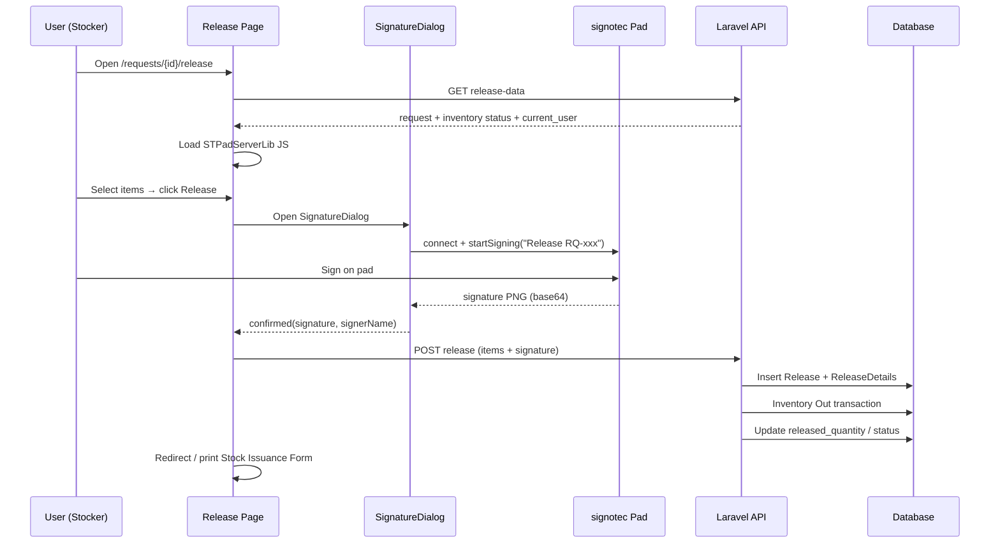

# End-to-End Flow: Request Release + Receiver Signature

> A step-by-step walkthrough of the request releasing process, from page load to printed Stock Issuance Form. File paths and line numbers are included for navigation.

---

## 1. Navigate to the Release Page

**Route (web):** `routes/web/request.php:11`
```php
Route::get('/requests/{request}/release', [RequestController::class, 'release'])->name('requests.release');
```

**Controller:** `app/Http/Controllers/Web/RequestController.php:40`
```php
public function release(Request $request)
{
    return Inertia::render('Request/Release/Index', ['requestId' => $request->id]);
}
```

Renders `resources/js/pages/Request/Release/Index.vue` (298 lines).

---

## 2. Page Load — Fetch Release Data + Load Pad Library

On mount, `Index.vue` performs two parallel tasks:

**a) Fetch release data** — `requestService.releaseData(requestId)` → `GET /api/requests/{id}/release-data` → `Api\RequestController::releaseData()` (line 256):
- Loads the request with its details (`where quantity != 0`)
- Loads user + department
- Calls `InventoryApiService::checkProductQuantity()` per line item → builds `inventoryStatus`
- Returns `current_user` (id + name) — **used as the default signer name**

**b) Load the signotec SDK** — dynamic script tag (Index.vue lines 131–154):
```html
<script src="/js/STPadServerLib-3.5.0.js"></script>
```

---

## 3. User Selects Items

- **`components/request/release/ItemsTable.vue`** (200 lines) — checkbox table with:
  - `release_now` quantity inputs
  - Remaining-quantity logic
  - Inventory status badges
- **`components/request/release/Controls.vue`** (67 lines) — "Select All" + **"Release & Update Inventory"** button; emits `toggleSelectAll` and `releaseItems`.

---

## 4. Open Signature Dialog

`Index.vue:158` — `releaseItems()`:
1. Validates at least one item is selected.
2. Opens `SignatureDialog` (rendered at lines 290–297).

Props passed: `request-no`, `signer-name` (defaults to request creator).

---

## 5. Capture Receiver Signature

The `SignatureDialog` component (`components/signature/SignatureDialog.vue`, 361 lines) supports **two modes**:

| Mode | Method | Implementation |
|------|--------|----------------|
| **Signature Pad** (primary) | signotec STPad hardware | `useSignaturePad.ts` — WebSocket `wss://localhost:49494` |
| **Draw On-Screen** (fallback) | HTML5 canvas | `useCanvasSignature.ts` — mouse + touch drawing |

- Steps: `connecting → ready → signing → preview → error`
- `beginsSigning()` (line 89): pad → `startSigning(\`Release ${requestNo}\`)`
- `confirmCanvasSignature()` (line 103): snapshots canvas base64
- `confirmRelease()` (line 111): emits the confirmed signature + signer name

> ⚠️ See [[Receiver-Signature]] for the complete hardware/software signature mechanics.

---

## 6. Submit Release + Signature

`Index.vue:185` — `handleSignatureConfirmed(signature, signerName)`:
```js
await requestService.release(props.requestId, {
    items: itemsToRelease,          // [{ request_detail_id, quantity }]
    notes: 'Items released from request',
    signature: {
        image: signature.imageData,
        signer_id: currentUser.value.id,
        signer_name: signerName,
        signed_at: new Date().toISOString(),
    },
});
```

**Service:** `resources/js/services/requestService.ts:66` → `POST /api/requests/{id}/release`

---

## 7. Server-Side Processing

**Controller:** `app/Http/Controllers/Api/RequestController.php:488` — `releaseItems(ReleaseItemsRequest, Request, InventoryApiService)`

1. **Extract signature** (line 497): `$signatureData = $validated['signature'] ?? null;`
2. **Create `Release`** (lines 499–507):
   ```php
   $release = Release::create([
       'request_id'      => $request->id,
       'user_id'         => $authUser->id,
       'release_date'    => now(),
       'notes'           => $validated['notes'] ?? null,
       'signature_image' => $signatureData['image'] ?? null,
       'signed_by'       => $signatureData['signer_name'] ?? null,
       'signed_at'       => $signatureData['signed_at'] ? \Carbon\Carbon::parse(...) : null,
   ]);
   ```
3. **Sync inventory** — `Out` transaction per item with an `item_id`.
4. **Create `ReleaseDetail` rows** — increments `request_detail.released_quantity`.
5. **Update tracking status** — `completed` / `partial`.
6. **Update request status** — `released` / `partially_released` (`updateRequestStatus()` line 686).
7. **Log activity** — `ActivityLogger` "Released Items".

**Validation:** `app/Http/Requests/ReleaseItemsRequest.php`:
```php
'notes' => 'nullable|string',
'signature' => 'nullable|array',
'signature.image' => 'nullable|string',      // base64 data
'signature.signer_id' => 'nullable|integer',
'signature.signer_name' => 'nullable|string',
'signature.signed_at' => 'nullable|date',
```

---

## 8. Print — STOCK ISSUANCE FORM

**Component:** `components/printables/ReleasedItemsPrint.vue` (289 lines)

- Title: **"STOCK ISSUANCE FORM"**
- Signature overlay (lines 226–241):
  ```html
  <div v-if="getLatestRelease()?.signature_image" class="absolute inset-0 ...">
      
  </div>
  <p>Received By: <span>{{ getLatestRelease()?.signed_by }}</span></p>
  ```
- Triggered from `pages/Request/Show.vue` (lines 36 / 81 / 93).

---

## 9. Reporting

- **Report screen:** `pages/Reports/Requests/ReleasedItems.vue`
- **Controller:** `Report/RequestReportController.php:13` — `releasedItems()`
- Eager-loads `Release → request.department`, `details.requestDetail`, ordered by `release_date desc`.

---



---

> [!info] Related
> - [[Overview|Releasing Process Overview]]
> - [[Receiver-Signature|Receiver Signature Capture]]
> - [[Inventory-Integration|Inventory Integration & Auto-Deduction]]
> - [[Data-Model|Data Model]]
> - [[API-Reference|API Reference]]