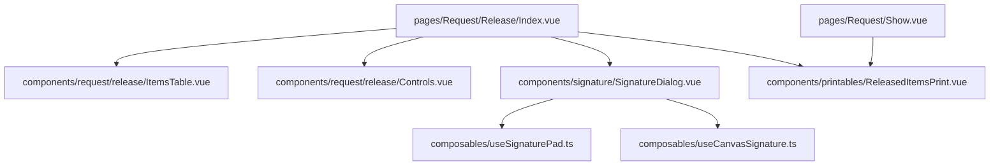

# Frontend Components — Releasing

> The Vue components that make up the releasing UI, from the release page down to the signature dialog.

---

## Component Tree



---

## 1. `pages/Request/Release/Index.vue` (298 lines)

**The release page.** Responsibilities:

- **Loads release data** on mount:
  ```ts
  const response = await requestService.releaseData(props.requestId)
  ```
  → populates `details`, `formDetails`, `selectedItems`, `inventoryStatus`, `currentUser`.
- **Loads the signotec SDK** via a dynamic `<script>` tag (lines 131–154):
  ```html
  <script src="/js/STPadServerLib-3.5.0.js"></script>
  ```
- **`releaseItems()`** (line 158) — validates selection, then opens `SignatureDialog`.
- **`handleSignatureConfirmed(signature, signerName)`** (line 185) — POSTs to the API:
  ```ts
  await requestService.release(props.requestId, {
      items: itemsToRelease,
      notes: 'Items released from request',
      signature: {
          image: signature.imageData,
          signer_id: currentUser.value.id,
          signer_name: signerName,
          signed_at: new Date().toISOString(),
      },
  });
  ```
- Renders `<SignatureDialog :signer-name="request creator name">` (lines 290–297).

---

## 2. `components/request/release/ItemsTable.vue` (200 lines)

**The item selection table.**

- Props: `details`, `formDetails`, `selectedItems`, `inventoryStatus`, `validationErrors`
- Emits: `update:selectedItems`, `update:releasedQuantity`, `removeDetail`

Key behaviors:
- **Checkbox toggle** — selecting an item auto-fills `release_now` with the remaining quantity.
- **Fully released items** — replaced with a green `PackageCheck` icon + "Completed", input disabled.
- **Remaining quantity** = `detail.quantity - detail.released_quantity`.
- **Quantity validation** — release qty > remaining shows a red border + "Exceeds quantity" alert.
- **Inventory status column**:
  - 🔘 `PackageX` — "Not Linked" (no `item_id`)
  - ⛔ `AlertCircle` — "Not Found" in inventory
  - ✅ `Package` — "N available" (sufficient)
  - ⚠️ `AlertCircle` — "Low Stock (N)" (insufficient)

---

## 3. `components/request/release/Controls.vue` (67 lines)

**Toolbar above the table.**

- **Select All** checkbox — emits `toggleSelectAll`
- **"Release & Update Inventory"** button — emits `releaseItems` (opens the signature dialog)

---

## 4. `components/signature/SignatureDialog.vue` (361 lines)

**The receiver signature capture dialog.** Full detail in [[Receiver-Signature]].

- Props: `open`, `requestNo`, `signerName`
- Emits: `confirmed(signature, signerName)`, `cancelled`, `update:open`
- Steps: `connecting → ready → signing → preview → error`
- Modes: **Signature Pad** (signotec) / **Draw On-Screen** (canvas)
- Auto-fallback to canvas when pad connection fails.
- Editable signer name; preview before final confirm.

---

## 5. `composables/useSignaturePad.ts` (290 lines)

**signotec pad integration.**

- `connect()` → WebSocket `wss://localhost:49494`
- `searchForPads()` → finds pad `1000401383` (hard-coded) or first available
- `startSigning(promptText)` → registers device handlers, calls `getSignatureImage` with retry
- `cancelSigning()` / `disconnect()`

---

## 6. `composables/useCanvasSignature.ts` (95 lines)

**Canvas fallback.**

- Mouse + touch drawing with coordinate scaling
- `getBase64()` → PNG base64 **without** `data:` prefix
- `getResult()` → `{ imageData }` matching `SignatureResult`

---

## 7. `components/printables/ReleasedItemsPrint.vue` (289 lines)

**"STOCK ISSUANCE FORM" printout.**

- Renders the release signature overlay (lines 226–241):
  ```html
  
  ```
- **Received By:** `getLatestRelease()?.signed_by`
- Triggered from `pages/Request/Show.vue` (lines 36 / 81 / 93).

---

## 8. `pages/Request/Show.vue`

**Request detail page.** Contains the print trigger and renders `ReleasedItemsPrint` for the Stock Issuance Form.

---

## Component → Concern Matrix

| Concern | Component(s) |
|---------|--------------|
| Page orchestration | `Request/Release/Index.vue` |
| Item selection / qty | `ItemsTable.vue`, `Controls.vue` |
| Signature capture (pad) | `SignatureDialog.vue` + `useSignaturePad.ts` |
| Signature capture (canvas) | `SignatureDialog.vue` + `useCanvasSignature.ts` |
| Print output | `ReleasedItemsPrint.vue` |
| API client | `requestService.ts` → `api.ts` |

---

> [!info] Related
> - [[Overview|Releasing Process Overview]]
> - [[Receiver-Signature|Receiver Signature Capture]]
> - [[Packages-Used|Packages Used]]
> - [[API-Reference|API Reference]]