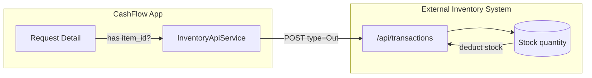

# Inventory Integration — Auto-Deduction on Release

> When a request item is **linked to the inventory system**, releasing it **automatically deducts stock** from inventory by creating an **`Out` transaction** on the external inventory API. Items without an inventory link are released normally but skip the deduction.

---

## The Big Picture



- **CashFlow** is a separate app from the **Inventory System**.
- They communicate over HTTP using `InventoryApiService` (`app/Services/InventoryApiService.php`).
- Base URL: `INVENTORY_API_URL` env (`config/services.php:39`), default `http://192.168.0.145`.

---

## How a Request Item Links to Inventory

Each `request_detail` has an `item_id` column. If it is set, the item is "linked":

```php
if ($requestDetail->item_id) {
    // item is linked → sync with inventory
} else {
    // no link → release proceeds, sync skipped
}
```

> [!note] Link origin
> Items are linked when the request is created/edited — the product is picked from the inventory product list and its `item_id` is stored on the `RequestDetail`. See `RequestForm.vue` (product `Combobox`).

---

## Inventory Status Shown Before Release

On the release page (`GET /api/requests/{id}/release-data`, `RequestController::releaseData` line 256), each line item is checked against inventory:

**Per-detail status object:**
```json
{
  "has_item_id": true,
  "exists": true,
  "available_quantity": 42,
  "has_stock": true,
  "sufficient_for_request": true
}
```

This powers the **Inventory** column in `ItemsTable.vue`:

| Indicator | Condition | Meaning |
|-----------|-----------|---------|
| 🔘 PackageX "Not Linked" | `has_item_id = false` | No `item_id` → no auto-deduction |
| ⛔ AlertCircle "Not Found" | `exists = false` | Item missing in inventory system |
| ✅ Package "N available" | `sufficient_for_request = true` | Enough stock |
| ⚠️ AlertCircle "Low Stock (N)" | `sufficient_for_request = false` | Not enough stock |

**Implementation:** `InventoryApiService::checkProductQuantity($item_id)` → `GET {baseUrl}/api/productCode/{id}`.

---

## The Auto-Deduction (Release Execution)

**Location:** `app/Http/Controllers/Api/RequestController.php` → `releaseItems()` (line 488).

### Step-by-step

1. Release `DB::beginTransaction()` starts.
2. `Release` row created (with signature).
3. **For each released item** (`RequestController.php:535`):
   - If `requestDetail->item_id` is **null** → `inventorySkipped++`, no API call (line 565-568).
   - If `item_id` **exists** → build an `Out` transaction payload:

   ```php
   $inventoryData = [
       'item_id'            => $requestDetail->item_id,
       'user_id'            => $authUser->id,
       'type'               => 'Out',
       'quantity'           => $item['quantity'],
       'source_destination' => $request->department->department_name ?? 'N/A',
       'personnel_name'     => trim(($request->user->first_name ?? '') . ' ' . ($request->user->last_name ?? '')),
       'reference_no'       => 'REL-' . now()->format('YmdHis') . '-' . $requestDetail->id,
       'note'               => $request->purpose ?? 'N/A',
   ];
   ```

   → `InventoryApiService::createTransaction($inventoryData)` → `POST {baseUrl}/api/transactions`.

4. **If the inventory API fails** (`!$inventoryResult['success']`), a `\Exception` is thrown → **the whole release rolls back** (line 556-561, 659-667).
5. `ReleaseDetail` rows created; `released_quantity` incremented; `tracking_status` set.

### The `Out` transaction = the deduction

The external inventory system treats a transaction with `type = 'Out'` as a **stock decrease** for `item_id` by `quantity`.

- Reference no format: `REL-YYYYMMDDHHMMSS-{requestDetailId}` (e.g., `REL-20260804103015-12`).
- `source_destination` = requesting department.
- `personnel_name` = the request creator's full name.

---

## Failure Handling

| Scenario | Behavior |
|----------|----------|
| Inventory API unreachable | `createTransaction` catches exception → `success: false` → release **rolled back** |
| Inventory API returns error status | `success: false` → release **rolled back** |
| Item not linked (`item_id = null`) | **No API call** — release proceeds, counted as `inventory_skipped` |
| All items linked & success | `inventory_synced = N`, release committed |

The API response tells the frontend exactly what happened:

```json
{
  "success": true,
  "message": "Items released successfully. 2 item(s) were not synced to inventory (no link).",
  "data": {
    "release": { "...": "..." },
    "request": { "...": "..." },
    "inventory_synced": 3,
    "inventory_skipped": 2
  }
}
```

---

## Activity Logging

After commit, `ActivityLogger` records (`RequestController.php:633-644`):

```
Released {total} items for request #{request_no}. Inventory synced: {N}, skipped (unlinked): {M}
```

With structured data: `request_no`, `released_quantity`, `inventory_synced`, `inventory_skipped`.

---

## Configuration

**`config/services.php`**
```php
'inventory' => [
    'base_url' => env('INVENTORY_API_URL', 'http://192.168.0.145'),
    'timeout'  => env('INVENTORY_API_TIMEOUT', 10),
],
```

**`.env`**
```
INVENTORY_API_URL=http://192.168.0.145
```

> [!warning] Production dependency
> The inventory system must be reachable from the CashFlow server. If it goes down, any release of **linked** items will fail (transaction rollback). Unlinked items are unaffected.

---

## Inventory API Endpoints Used

| Method | Endpoint | Purpose |
|--------|----------|---------|
| `GET` | `/api/items` | List items |
| `GET` | `/api/productCode` | List all products |
| `GET` | `/api/productCode/{id}` | Product + `quantity` (stock check) |
| `POST` | `/api/transactions` | Create **Out** transaction (auto-deduct) |

All calls use a 10-second timeout (`Http::timeout(10)`).

---

## Quick Reference

- Service: `app/Services/InventoryApiService.php`
- Config: `config/services.php:38`
- Check stock: `checkProductQuantity()` (line 51)
- Create deduction: `createTransaction()` (line 154)
- Release logic: `RequestController::releaseItems()` (line 488, inventory branch line 535)
- Status pre-check: `RequestController::releaseData()` (line 256)
- Frontend display: `ItemsTable.vue` Inventory column

---

> [!info] Related
> - [[End-to-End-Flow|End-to-End Flow]]
> - [[Data-Model|Data Model]]
> - [[Receiver-Signature|Receiver Signature Capture]]