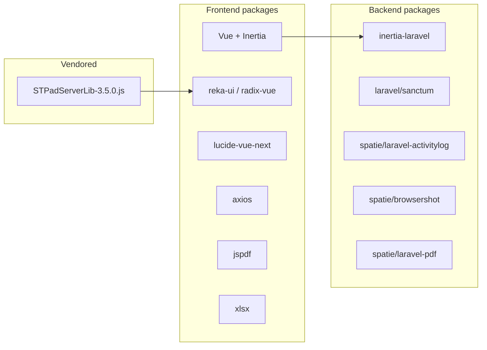

# Packages Used (Releasing Process)

> Every library and package involved in the releasing process — signature capture, printing, spreadsheets, activity logging, and PDF generation. Both frontend (npm) and backend (Composer) are covered.

---

## Frontend — `package.json`

### Signature Capture
| Package                                   | Version          | Used for                                                                                                                                                                                                        |
| ----------------------------------------- | ---------------- | --------------------------------------------------------------------------------------------------------------------------------------------------------------------------------------------------------------- |
| ⚙️ **signotec `STPadServerLib-3.5.0.js`** | 3.5.0 (vendored) | **Physical signature pad** — NOT an npm dependency. Manual file at `public/js/STPadServerLib-3.5.0.js` (2,220 lines, signotec GmbH SDK, MIT). Loaded via dynamic `<script>` tag in `Request/Release/Index.vue`. |
| (None)                                    | —                | On-screen canvas fallback is **hand-rolled** (`useCanvasSignature.ts`) — no `signature_pad` / `vue-signature-pad` library is used.                                                                              |

> [!note] Signature library decision
> No dedicated npm signature package is installed. Hardware signing depends entirely on the **vendored signotec SDK**, and the software fallback is custom Canvas 2D code. See [[Receiver-Signature]].

### UI & Framework
| Package | Version | Notes |
|---------|---------|-------|
| `vue` | ^3.5.13 | Frontend framework |
| `@inertiajs/vue3` | ^2.0.0-beta.3 | Inertia.js adapter |
| `reka-ui` | ^2.9.6 | Headless UI primitives (shadcn-vue base) |
| `radix-vue` | ^1.9.11 | Headless UI primitives |
| `lucide-vue-next` | ^0.468.0 | Icons (PenLine, Signature, Delete, etc.) |
| `vue-toastification` | ^2.0.0-rc.5 | Toast notifications (all use in api.ts / services) |
| `@vueuse/core` | ^12.8.2 | Vue utilities (present, not core to signature) |
| `axios` | ^1.8.4 | HTTP client for API services |
| `class-variance-authority` | ^0.7.1 | shadcn-vue variant styling |
| `tailwindcss` / `tailwindcss-animate` | ^3.4.1 / ^1.0.7 | Styling |
| `@tanstack/vue-table` | ^8.21.2 | Table primitives |
| `lucide` | ^0.468.0 | Icon set |

### Printing & Reporting
| Package | Version | Used for |
|---------|---------|----------|
| `jspdf` | ^3.0.2 | Client-side PDF generation |
| `jspdf-autotable` | ^5.0.2 | PDF tables (printouts) |
| `xlsx` | ^0.18.5 | Spreadsheet export |
| `file-saver` | ^2.0.5 | Save generated files |
| `puppeteer` | ^24.9.0 | Headless browser (server-side HTML→PDF/print) |

### Charts & Dev
| Package | Version | Notes |
|---------|---------|-------|
| `chart.js` / `vue-chartjs` | ^4.5.0 / ^5.3.2 | Dashboards |
| `vite` | ^6.2.0 | Build tool |
| `typescript` | ^5.2.2 | Types |
| `vue-tsc` | ^2.2.4 | Type-checking |

---

## Backend — `composer.json`

### Release-Related / Core
| Package | Version | Used for |
|---------|---------|----------|
| `inertiajs/inertia-laravel` | ^2.0 | Server-side Inertia rendering |
| `laravel/framework` | ^12.0 | Core |
| `laravel/sanctum` | ^4.0 | **API auth** (`auth:sanctum`) |
| `spatie/laravel-activitylog` | ^4.10 | Activity logging (e.g., "Released Items") |
| `maatwebsite/excel` | ^3.1 | Spreadsheet imports/exports |
| `spatie/browsershot` | ^5.0 | HTML → image/PDF via headless Chrome |
| `spatie/laravel-pdf` | ^1.5 | PDF generation |
| `tightenco/ziggy` | ^2.4 | Laravel routes in JS |

> [!note] No server-side signature PHP package
> There is **no signotec / PKCS#7 / image-processing** PHP package. Signature images are stored as raw base64 text and rendered client-side with `data:image/png;base64,`.

### Dev & Tooling
| Package | Version |
|---------|---------|
| `laravel/tinker` | ^2.10.1 |
| `laravel/pint` | ^1.18 |
| `laravel/sail` | ^1.41 |
| `phpunit/phpunit` | ^11.5.3 |
| `nunomaduro/collision` | ^8.6 |
| `mockery/mockery` | ^1.6 |
| `laravel/pail` | ^1.2.2 |

---

## How the signotec Pad SDK is Loaded

In **`resources/js/pages/Request/Release/Index.vue`** (lines 131–154), the SDK is injected at runtime:

```html
<script src="/js/STPadServerLib-3.5.0.js"></script>
```

It exposes globals consumed by `useSignaturePad.ts`:
- `window.STPadServerLib.STPadServerLibCommons` → `createConnection`
- `window.STPadServerLib.STPadServerLibDefault` → `searchForPads`, `openPad`, `startSignature`, `getSignatureImage`, `stopSignature`, `closePad`, `cancelSignature`

> [!tip] Why not an npm package?
> The signotec SDK is a large vendor-specific library typically delivered as a static file, not a published npm package — hence the manual vendoring under `public/js/`.

---




> [!info] Related
> - [[Receiver-Signature|Receiver Signature Capture]]
> - [[End-to-End-Flow|End-to-End Flow]]
> - [[Frontend-Components|Frontend Components]]