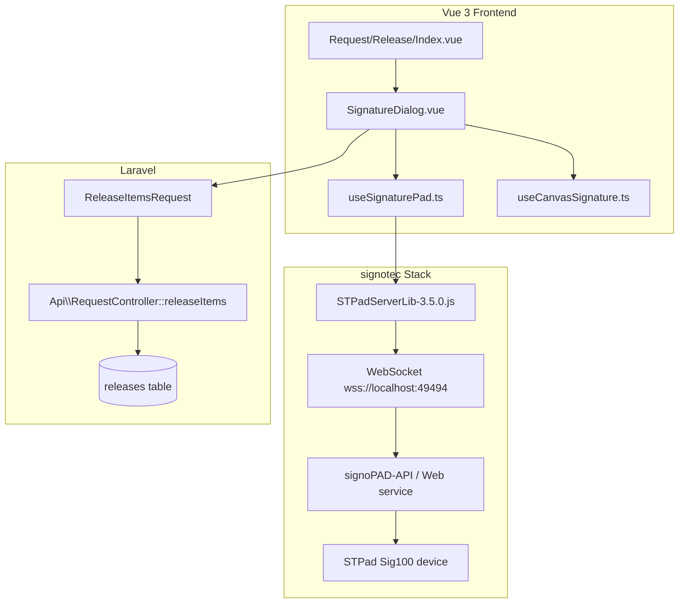

# Receiver Signature Capture

> The heart of the releasing process — how the receiver's signature is captured from a physical **signotec STPad** device, with a built-in **on-screen canvas fallback**, and how that signature is stored and rendered.

---

## Architecture Overview



## The Two Signature Modes

| Mode | Primary? | How it works | Implementation |
|------|----------|--------------|----------------|
| **Signature Pad** | ✅ Primary | Physical signotec STPad over WebSocket | `useSignaturePad.ts` |
| **Draw On-Screen** | 🔀 Fallback | HTML5 canvas (mouse/touch) | `useCanvasSignature.ts` |

The dialog auto-detects the pad. If the WebSocket connection fails, it **silently falls back to canvas mode** (no hard error — see `SignatureDialog.vue:75-86`).

---

## Mode 1 — signotec Signature Pad (`useSignaturePad.ts`)

**File:** `resources/js/composables/useSignaturePad.ts` (290 lines)

### Connection Flow

1. **`connect()`** — creates a WebSocket to `wss://localhost:49494` via `commons.createConnection(...)`.
2. **`searchForPads()`** — calls `defaults.searchForPads()`, then looks for the **hard-coded target serial `1000401383`** (`useSignaturePad.ts:79`). If not found, falls back to the first discovered pad.
3. **`openPad(index)`** — opens the pad and stores `padInfo` (pad type + serial number).

> [!warning] Hard-coded pad serial
> `useSignaturePad.ts:79` pins the pad by serial number `1000401383`. If a replacement pad is connected, the code falls back to "first available pad" — but only after logging a warning. Consider making this configurable.

### Signing Flow

**`startSigning(promptText)`** (line 130):
1. Registers `defaults.handleConfirmSignature` — fires when the receiver presses **Confirm on the device**.
2. Registers `defaults.handleCancelSignature` and `defaults.handleRetrySignature`.
3. Calls `defaults.startSignature()` with custom text: `"Release {requestNo}"`.
4. On confirm:
   - Waits ~500ms for the device to process.
   - Calls `defaults.stopSignature()` after another 300ms.
   - Retries `defaults.getSignatureImage()` (PNG) **up to 4 attempts**, with exponential delay (`attempt * 400ms`).
   - Resolves with `{ imageData: result.file, signaturePoints: null, signatureTime: Date.now() }`.
5. A `window.onerror` guard suppresses the library's benign `"Cannot read properties of null"` parsing error.

### Cleanup

**`disconnect()`** (line 260) — closes the pad (`closePad`) and destroys the WebSocket connection.

---

## Mode 2 — On-Screen Canvas (`useCanvasSignature.ts`)

**File:** `resources/js/composables/useCanvasSignature.ts` (95 lines)

- Canvas **400 × 160** logical pixels, rendered full-width via CSS (`w-full`).
- Stroke: `#000000`, width **2.5**, `round` caps/joins.
- **Coordinate scaling** — maps pointer position through `getBoundingClientRect()` so drawing is accurate regardless of CSS scaling.
- Mouse **and** touch handlers (`@touchstart.prevent`, etc. — prevents page scroll while signing).
- `getBase64()` (line 67) returns base64 PNG **without** the `data:image/png;base64,` prefix.
- `getResult()` (line 74) returns `{ imageData: getBase64() }` — shape-compatible with `SignatureResult`.
- `hasDrawn` tracks whether real stroke pixels exist (used to gate the Confirm button).

---

## SignatureDialog Component (`SignatureDialog.vue`, 361 lines)

**Props:** `open`, `requestNo`, `signerName`
**Emits:** `confirmed(signature, signerName)`, `cancelled`, `update:open`

### Dialog Steps (state machine)
```
connecting → ready → signing → preview → error
```

| Step | Description |
|------|-------------|
| **connecting** | Spinner while `connect()` runs |
| **ready** | Mode tabs (Pad / Draw), editable signer name, Start Signing button |
| **signing** | Waiting for the receiver to sign on the device |
| **preview** | Shows the captured signature image + signer name + timestamp; Re-sign / Confirm & Release |
| **error** | Checklist: signoPAD-API running, Sig100 plugged in, driver installed |

### Key behaviors

- **Canvas snapshot on confirm** — `confirmCanvasSignature()` (line 103) snapshots the base64 **before** switching to preview, so the image doesn't go blank when the canvas is unmounted from the DOM flow.
- **Editable signer name** — `editableSignerName` defaults to the request creator, but the signer can be edited.
- **Auto-close cleanup** — on close: cancels signing, disconnects pad, clears canvas.

---

## Storage

**Table:** `releases` — columns added by `database/migrations/2025_05_18_000000_add_signature_fields_to_releases_table.php`:

| Column | Type | Notes |
|--------|------|-------|
| `signature_image` | `text` nullable | Raw **base64 PNG** string (no `data:` prefix) |
| `signed_by` | `string` nullable | Receiver's name |
| `signed_at` | `timestamp` nullable | When signed |

**Model:** `app/Models/Release.php` — fillable includes `signature_image`, `signed_by`, `signed_at`.

### Payload sent to backend
```json
{
  "items": [{ "request_detail_id": 10, "quantity": 2 }],
  "notes": "Items released from request",
  "signature": {
    "image": "<base64-png>",
    "signer_id": 5,
    "signer_name": "Juan Dela Cruz",
    "signed_at": "2026-08-04T10:30:00.000Z"
  }
}
```

---

## Rendering in Print — STOCK ISSUANCE FORM

**Component:** `components/printables/ReleasedItemsPrint.vue` (lines 226–241)

```html
<div v-if="getLatestRelease()?.signature_image" class="absolute inset-0 ...">
    
</div>
<p>Received By: <span>{{ getLatestRelease()?.signed_by }}</span></p>
```

- Uses **the latest release's** signature (`getLatestRelease()`).
- Re-prefixes `data:image/png;base64,` for browser rendering.

---

## Troubleshooting Checklist (from the error step)

- ✅ signoPAD-API / Web service is running
- ✅ Sig100 is plugged in via USB
- ✅ Driver is installed
- ✅ WebSocket `wss://localhost:49494` is reachable (note: **wss** — TLS even on localhost)

---

> [!info] Related
> - [[End-to-End-Flow|End-to-End Flow]]
> - [[Packages-Used|Packages Used]]
> - [[Data-Model|Data Model]]